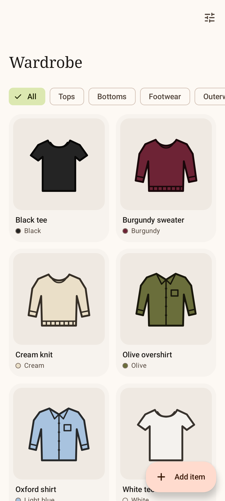
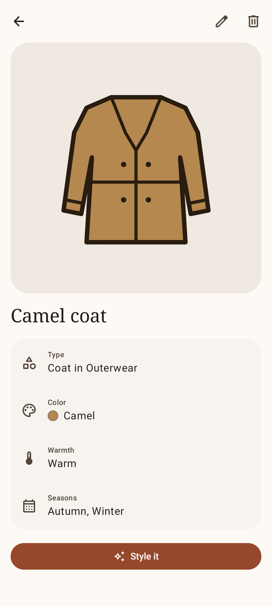
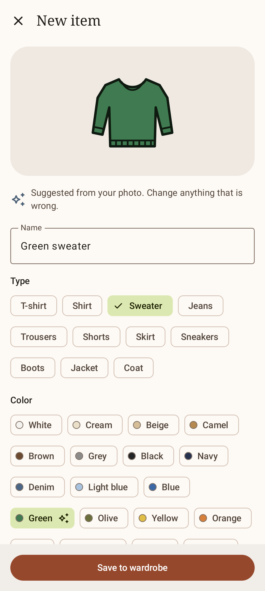
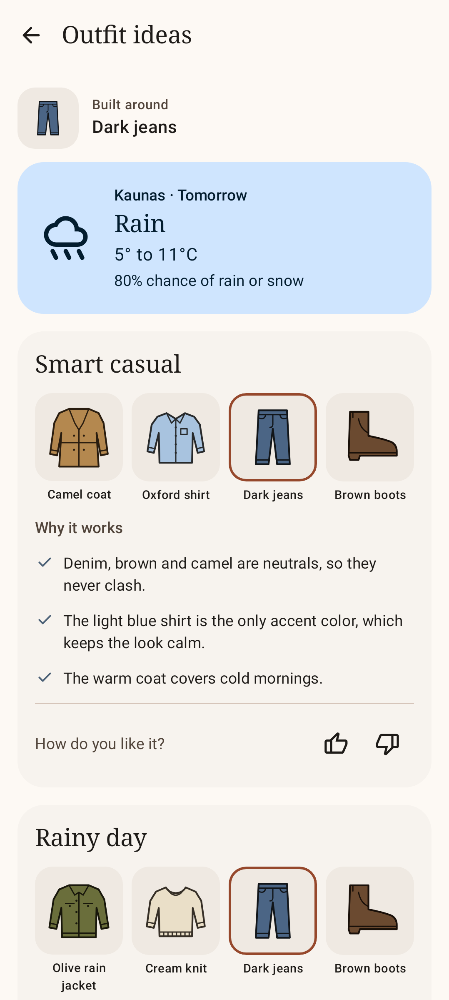

# Clankdrobe

Android app. Catalog of the clothes you own, outfit suggestions built from it.

Status: prototype for presentation I. All data is sample data held in memory.

| Wardrobe | Item | Add item | Outfit ideas |
|---|---|---|---|
|  |  |  |  |

## Requirements

- JDK 17
- Android SDK Platform 37: `sdkmanager "platforms;android-37.0"`
- Device or emulator with Android 8.0 (API 26) or newer

## Build and run

```
./gradlew assembleDebug    # build app/build/outputs/apk/debug/app-debug.apk
./gradlew installDebug     # install on the connected device
```

## Use

| Screen | Actions |
|---|---|
| Wardrobe tab | Category chips. Filter icon: colors, seasons. Tap a card for details. Add item button. |
| Item | Edit. Delete, with Undo on the snackbar. Style it: outfit ideas for this item, today. |
| Add item | Take a photo or Choose from gallery, then confirm the suggested type and color, set warmth and seasons, Save. |
| Outfits tab | Pick a day and an item, Show outfits. Like or dislike each outfit. |
| Settings tab | Theme: System, Light, Dark. |

## Prototype limits

| Feature | Now |
|---|---|
| Storage | In memory. A restart restores the 17 sample items. |
| Photo recognition | No camera. Returns green sweater, red sneakers, navy coat, in turn. |
| Outfits | Three fixed outfits, only for Dark jeans. |
| Weather | Fixed sample week for Kaunas, starting today. Celsius only. |
| Likes | Kept until the results screen closes. |
| Theme | Kept until the app restarts. |

## Test

```
./gradlew testDebugUnitTest      # unit and Compose UI tests (Robolectric)
./gradlew verifyRoborazziDebug   # same, plus screenshot comparison
./gradlew recordRoborazziDebug   # re-record screenshots after an intended UI change
./gradlew lintDebug
```

- Reference screenshots: `app/src/test/screenshots/`
- CI: `.github/workflows/ci.yml` runs `assembleDebug verifyRoborazziDebug lintDebug` on every push to `main` and on pull requests.

## Code

```
app/src/main/java/app/wardrobe/
  AppContainer.kt         shared objects: repository, recognizer, forecast, theme
  data/                   repository, sample data, stand-in recognizer
  domain/model/           items, colors, forecast
  feature/wardrobe/       grid and filters
  feature/item/           detail, add, edit
  feature/outfits/        generator, results, sample outfits
  feature/settings/       settings
  navigation/             routes, back stacks per tab, app shell
  ui/                     theme, shared components, labels
tools/
  theme_palette.py        generates ui/theme/Color.kt, checks WCAG AA contrast
  install_icon.py         imports a Material Symbols icon into res/drawable
```

Screens with data: a ViewModel exposing one `StateFlow` of UI state, and a stateless `...Content` composable that the screenshot tests render. Settings reads the theme from `AppContainer`.

## Stack

Kotlin 2.4.20, Jetpack Compose (BOM 2026.09.00), Material 3, Navigation 3 1.2.0, AGP 9.4.1, Gradle 9.8.1. Tests: JUnit 4, Robolectric 4.17, Roborazzi 1.76.0.

Icons: Material Symbols, Apache License 2.0.
